<!-- Improved compatibility of back to top link: See: https://github.com/ZHU-Zhiyu/NVS_Solver/pull/73 -->

[![Issues][issues-shield]][issues-url]
<!-- [![MIT License][license-shield]][license-url] -->
<!-- [![MyHomePage][linkedin-shield]][linkedin-url] -->

<!-- PROJECT LOGO -->
 

  <h3 align="center">NVS-Solver: Video Diffusion Model as Zero-Shot Novel View Synthesizer</h3>
  

    <a href="https://github.com/ZHU-Zhiyu/NVS_Solver/issues">Report Bug</a>
    ·
    <a href="https://github.com/ZHU-Zhiyu/NVS_Solver/issues">Request Feature</a>
  

| Single-View       | Ignatius                                | Family                                | Palace                                | Church                                | Barn                                |
|----------------|----------------|----------------|----------------|----------------|----------------|
| Text2Nerf | 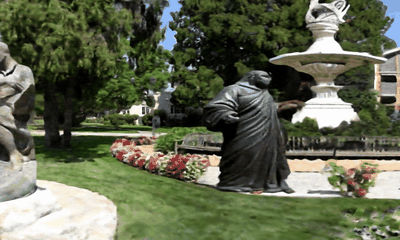 | 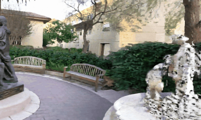 | 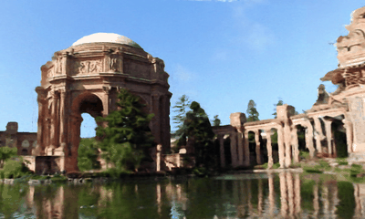 | 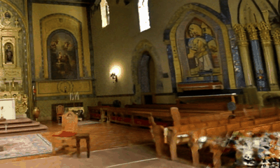 | 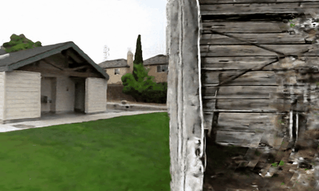 |
| MotionCtrl|  |  |  |  |  |
| NVS-Solver (DGS)  |  |  |  |  |  |
| NVS-Solver (Post) |  |  |  |  |  |

| Mono-Vid       |  Train                              | Kangroo                                | Train                                | Deer                                | Street                                |
|----------------|----------------|----------------|----------------|----------------|----------------|
| 4DGS | 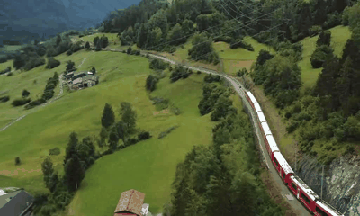 | 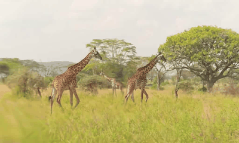 |  | 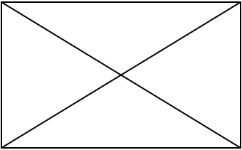 | 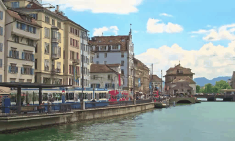 |
| MotionCtrl|  | 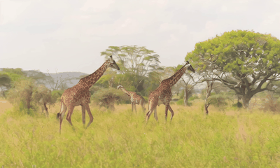 | 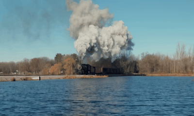 | 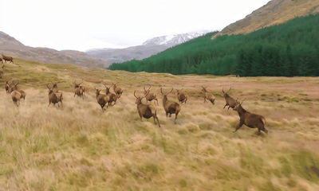 |  |
| NVS-Solver (DGS)  |  |  |  | 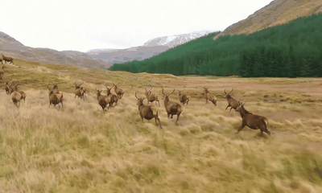 | 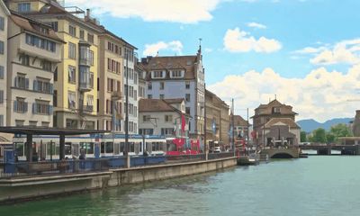 |
| NVS-Solver (Post) |  |  | 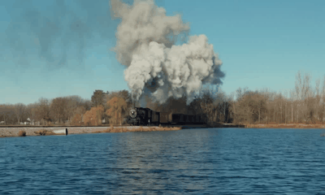 |  |  |

[contributors-shield]: https://img.shields.io/github/contributors/ZHU-Zhiyu/NVS_Solver.svg?style=for-the-badge
[contributors-url]: https://github.com/ZHU-Zhiyu/NVS_Solver/graphs/contributors
[forks-shield]: https://img.shields.io/github/forks/ZHU-Zhiyu/NVS_Solver.svg?style=for-the-badge
[forks-url]: https://github.com/ZHU-Zhiyu/NVS_Solver/network/members
[stars-shield]: https://img.shields.io/github/stars/ZHU-Zhiyu/NVS_Solver.svg?style=for-the-badge
[stars-url]: https://github.com/ZHU-Zhiyu/NVS_Solver/stargazers
[issues-shield]: https://img.shields.io/github/issues/ZHU-Zhiyu/NVS_Solver.svg?style=for-the-badge
[issues-url]: https://github.com/ZHU-Zhiyu/NVS_Solver/issues
[license-shield]: https://img.shields.io/github/license/ZHU-Zhiyu/NVS_Solver.svg?style=for-the-badge
[license-url]: https://github.com/ZHU-Zhiyu/NVS_Solver/blob/master/LICENSE.txt
